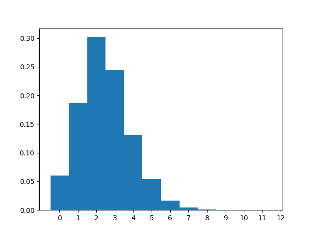
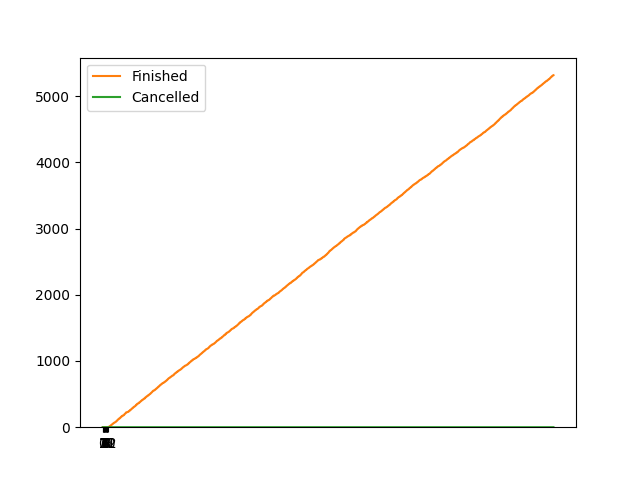

# Статистика

λ = 10.00

μ = 3.00

n = 2, m = 10

|                  |   count |    mean |      std |   min |   25% |   50% |   75% |   max |
|:-----------------|--------:|--------:|---------:|------:|------:|------:|------:|------:|
| Размер очереди   |  106380 | 0.76192 | 1.0376   |     0 |     0 |     0 |     1 |     7 |
| Занятые каналы   |  106380 | 1.69374 | 0.576718 |     0 |     2 |     2 |     2 |     2 |
| Заявки в системе |  106380 | 2.45566 | 1.36964  |     0 |     2 |     2 |     3 |     9 |

Всего отменено: 0

Всего выполнено: 5317

Вероятности для состояний системы:

|                           |         0 |        1 |        2 |        3 |        4 |         5 |         6 |          7 |           8 |           9 |          10 |          11 |         12 |
|:--------------------------|----------:|---------:|---------:|---------:|---------:|----------:|----------:|-----------:|------------:|------------:|------------:|------------:|-----------:|
| Теоретическая вероятность | 0.0536242 | 0.178747 | 0.297912 | 0.24826  | 0.137922 | 0.0574676 | 0.0191559 | 0.00532108 | 0.00126692  | 0.000263942 | 4.88782e-05 | 8.14637e-06 | 1.2343e-06 |
| Практическая вероятность  | 0.0600677 | 0.186125 | 0.302171 | 0.244585 | 0.131228 | 0.0542865 | 0.0164411 | 0.00433352 | 0.000742621 | 1.88005e-05 | 0           | 0           | 0          |

Рост числа выполненных и отменённых заявок со временем:

Количество заявок в каналах и очереди в течение времени выполнения:

|                                      |      Теор. |   Практ. |
|:-------------------------------------|-----------:|---------:|
| Вероятность отказа                   | 1.2343e-06 |  0       |
| Относительная пропускная способность | 0.999999   |  1       |
| Абсолютная пропускная способность    | 9.99999    | 10       |
| Длина очереди                        | 0.809662   |  0.76192 |
| Количество занятых каналов           | 1.714      |  1.69374 |
| Количество заявок в системе          | 2.52367    |  2.45566 |

|                         |   count |      mean |       std |   min |   25% |   50% |   75% |   max |
|:------------------------|--------:|----------:|----------:|------:|------:|------:|------:|------:|
| Время запроса в очереди |    5317 | 0.0612281 | 0.0936101 |  0    |  0    |  0.01 |  0.1  |  0.92 |
| Время запроса в системе |    5317 | 0.400103  | 0.350712  |  0.01 |  0.15 |  0.3  |  0.54 |  3.1  |

|                                             |   Значение |
|:--------------------------------------------|-----------:|
| Теор. среднее время пребывания заявки в СМО |        0.5 |

