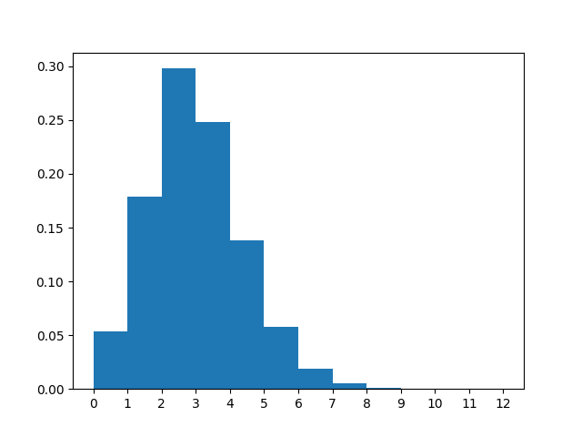
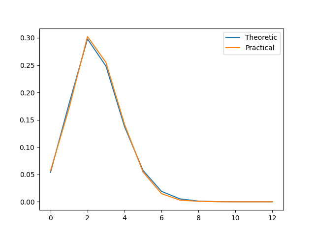
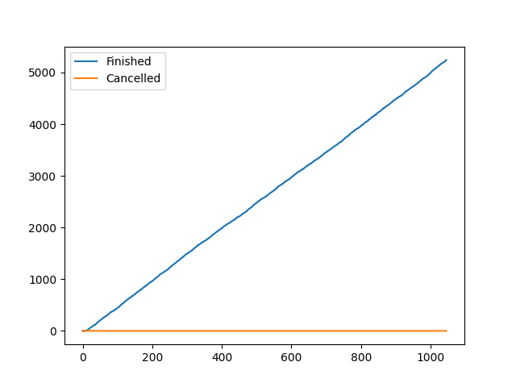
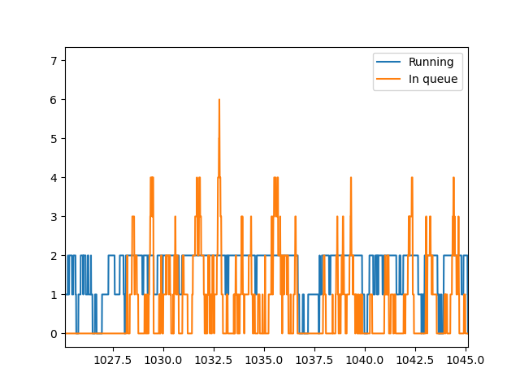

# Статистика

λ = 10.00

μ = 3.00

n = 2, m = 10

|                  |   count |     mean |     std |   min |   25% |   50% |   75% |   max |
|:-----------------|--------:|---------:|--------:|------:|------:|------:|------:|------:|
| Размер очереди   |  104513 | 0.784008 | 1.02683 |     0 |     0 |     0 |     1 |     7 |
| Занятые каналы   |  104513 | 1.71644  | 0.56199 |     0 |     2 |     2 |     2 |     2 |
| Заявки в системе |  104513 | 2.50044  | 1.34717 |     0 |     2 |     2 |     3 |     9 |

Всего отменено: 0

Всего выполнено: 5243

Теоретические вероятности для состояний системы:

Практические вероятности для состояний системы:

Сравнительный график теоретической и практической вероятностей системы:

|                           |         0 |        1 |        2 |        3 |        4 |         5 |         6 |          7 |           8 |           9 |          10 |          11 |         12 |
|:--------------------------|----------:|---------:|---------:|---------:|---------:|----------:|----------:|-----------:|------------:|------------:|------------:|------------:|-----------:|
| Теоретическая вероятность | 0.0536242 | 0.178747 | 0.297912 | 0.24826  | 0.137922 | 0.0574676 | 0.0191559 | 0.00532108 | 0.00126692  | 0.000263942 | 4.88782e-05 | 8.14637e-06 | 1.2343e-06 |
| Практическая вероятность  | 0.0563375 | 0.170888 | 0.302297 | 0.254916 | 0.141906 | 0.0546344 | 0.0149646 | 0.00300441 | 0.000870705 | 0.000181796 | 0           | 0           | 0          |

Рост числа выполненных и отменённых заявок со временем:

Количество заявок в каналах и очереди в течение времени выполнения:

|                                      |      Теор. |    Практ. |
|:-------------------------------------|-----------:|----------:|
| Вероятность отказа                   | 1.2343e-06 |  0        |
| Относительная пропускная способность | 0.999999   |  1        |
| Абсолютная пропускная способность    | 9.99999    | 10        |
| Длина очереди                        | 0.809662   |  0.784008 |
| Количество занятых каналов           | 1.714      |  1.71644  |
| Количество заявок в системе          | 2.52367    |  2.50044  |

|                         |   count |      mean |       std |   min |   25% |   50% |   75% |   max |
|:------------------------|--------:|----------:|----------:|------:|------:|------:|------:|------:|
| Время запроса в очереди |    5243 | 0.0639043 | 0.0938947 |  0    |  0    |  0.01 |  0.1  |  0.66 |
| Время запроса в системе |    5243 | 0.406056  | 0.343777  |  0.01 |  0.16 |  0.32 |  0.55 |  2.68 |

|                                             |   Значение |
|:--------------------------------------------|-----------:|
| Теор. среднее время пребывания заявки в СМО |        0.5 |

